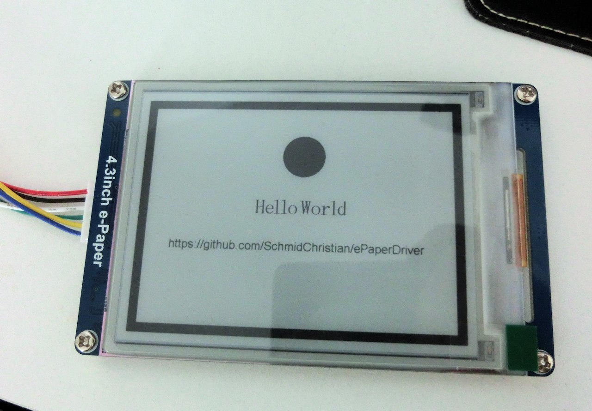

ePaperDriver
============
An easy to use java driver for ePaper / eInk displays with serial interface.
Driver can be used within java applications or in stand alone mode.

The driver is known to work with the following devices so far:
 * Waveshare 4.3 inch e-Paper display

Prerequisites
-------------
Serial communication with the display device is handled by the RXTX library.
For the driver to work, RXTX has to be installed on your system.

Installation instructions can be found e.g. here:

 - Windows: http://fizzed.com/oss/rxtx-for-java
 - On linux e.g. raspberry pi it should be available by package manager:
	 - `sudo apt-get install librxtx-java` 

Usage as library in java application
------------------------------------

 - Include the jar file to your java application. 
 - Obtain a `SerialEPaperDisplay`instance
 - Execute desired commands.

*Example:*
```
SerialEPaperDisplay display = new SerialEPaperDisplay("COM5");
display.connect();
display.displayText(300, 260, "Hello World");
display.repaint();
```

Usage in standalone mode
------------------------
Most of the commands are also available using a command line interface:
*Example:*
```
java -jar epaperdriver.jar --device COM5 --fill --drawCircle 200 300 125 --refresh
```

*To see full list of options use `--help`

Preview
-------



Code used
```
SerialEPaperDisplay display = new SerialEPaperDisplay("COM5");
display.connect();
display.drawRectangle(20, 20, 40, 580, true);
display.drawRectangle(20, 560, 780, 580, true);
display.drawRectangle(20, 20, 780, 40, true);
display.drawRectangle(760, 20, 780, 580, true);

display.setEnglishFontSize(DisplayFontSize.DotMatrix_64);
display.displayText(300, 260, "Hello World");

display.setEnglishFontSize(DisplayFontSize.DotMatrix_32);
display.displayText(100, 360, "https://github.com/SchmidChristian/ePaperDriver");

display.drawCircle(410, 160, 50, true);

display.repaint();
```

Debugging
-------
To get some more debug information you can set log level to trace:

`-Dorg.slf4j.simpleLogger.defaultLogLevel=trace`


Questions / answers
-------------------
If have have any further questions / comments you can drop me an email:

epaperdriver@schmid.tk
